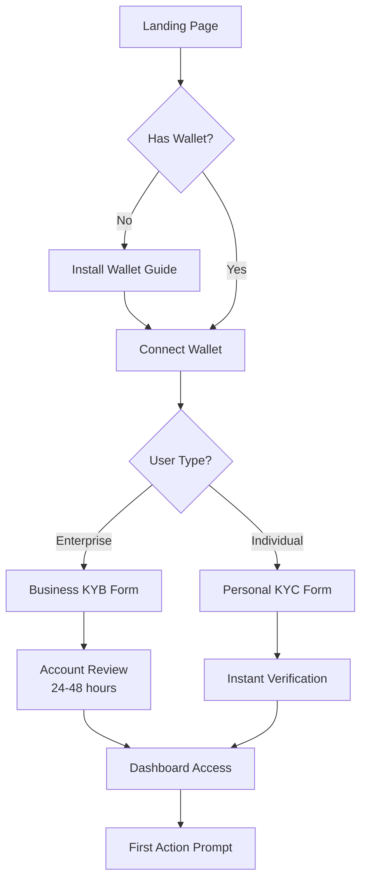
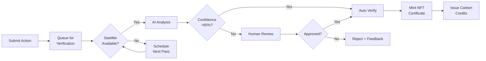
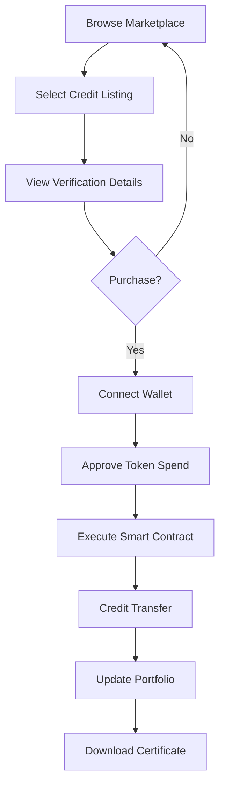

# DESIGN DOCUMENT
## ClimateChain
### Decentralized Climate Verification & Accountability Platform

**Version:** 1.0 | **Date:** February 2026 | **Status:** Draft

---

## 1. Design Overview

### 1.1 Design Philosophy
ClimateChain's visual identity embodies **trust, transparency, and environmental consciousness**. The design language combines:

- **Eco-Tech Aesthetics**: Merging natural gradients with futuristic blockchain elements
- **Zero-Trust Visualization**: Clear verification states and data authenticity indicators
- **Enterprise-Grade Professionalism**: Clean, data-dense interfaces for corporate users
- **Accessible Sustainability**: Approachable design for individual climate activists

### 1.2 Design Principles

| Principle | Description |
|-----------|-------------|
| **Clarity First** | Complex verification data presented with crystal-clear hierarchy |
| **Trust Signals** | Visual cues for blockchain verification, AI confidence scores |
| **Progressive Disclosure** | Layered information architecture for different user expertise levels |
| **Real-Time Feedback** | Live status indicators, streaming verification progress |
| **Sustainable Design** | Dark mode default (energy-efficient), minimal resource usage |

---

## 2. Visual Design System

### 2.1 Color Palette

#### Primary Colors
| Name | Hex | RGB | Usage |
|------|-----|-----|-------|
| **Earth Green** | `#10B981` | 16, 185, 129 | Primary actions, success states, verified indicators |
| **Ocean Blue** | `#0EA5E9` | 14, 165, 233 | Secondary actions, blockchain/Web3 elements |
| **Carbon Dark** | `#0F172A` | 15, 23, 42 | Primary backgrounds (dark mode) |
| **Pure White** | `#FFFFFF` | 255, 255, 255 | Text on dark, light mode backgrounds |

#### Secondary Colors
| Name | Hex | RGB | Usage |
|------|-----|-----|-------|
| **Forest Deep** | `#059669` | 5, 150, 105 | Hover states for green elements |
| **Teal Glow** | `#14B8A6` | 20, 184, 166 | Accent gradients, chart highlights |
| **Slate Gray** | `#64748B` | 100, 116, 139 | Secondary text, borders |
| **Ice Blue** | `#E0F2FE` | 224, 242, 254 | Light mode card backgrounds |

#### Semantic Colors
| Name | Hex | Usage |
|------|-----|-------|
| **Success** | `#22C55E` | Verified actions, completed states |
| **Warning** | `#F59E0B` | Pending verification, attention needed |
| **Error** | `#EF4444` | Failed verification, rejected claims |
| **Info** | `#3B82F6` | Informational tooltips, hints |

#### Gradient Combinations
```css
/* Primary Eco Gradient */
background: linear-gradient(135deg, #10B981 0%, #0EA5E9 100%);

/* Carbon Depth Gradient */
background: linear-gradient(180deg, #0F172A 0%, #1E293B 100%);

/* Verification Glow */
background: linear-gradient(90deg, #14B8A6 0%, #10B981 50%, #22C55E 100%);

/* Blockchain Accent */
background: linear-gradient(135deg, #0EA5E9 0%, #8B5CF6 100%);
```

### 2.2 Typography

#### Font Stack
```css
/* Primary Font - Clean, Modern, Highly Readable */
--font-primary: 'Inter', -apple-system, BlinkMacSystemFont, 'Segoe UI', sans-serif;

/* Monospace - For blockchain hashes, code, data */
--font-mono: 'JetBrains Mono', 'Fira Code', 'Consolas', monospace;
```

#### Type Scale
| Element | Size | Weight | Line Height | Usage |
|---------|------|--------|-------------|-------|
| **Display** | 48px / 3rem | 700 | 1.1 | Hero headlines, landing page |
| **H1** | 36px / 2.25rem | 700 | 1.2 | Page titles |
| **H2** | 28px / 1.75rem | 600 | 1.3 | Section headers |
| **H3** | 22px / 1.375rem | 600 | 1.4 | Card titles, subsections |
| **H4** | 18px / 1.125rem | 500 | 1.4 | Widget headers |
| **Body Large** | 18px / 1.125rem | 400 | 1.6 | Lead paragraphs |
| **Body** | 16px / 1rem | 400 | 1.5 | Default content |
| **Body Small** | 14px / 0.875rem | 400 | 1.5 | Secondary info, captions |
| **Caption** | 12px / 0.75rem | 500 | 1.4 | Labels, timestamps |
| **Overline** | 11px / 0.6875rem | 600 | 1.4 | Category labels (uppercase) |

### 2.3 Iconography

#### Icon System
- **Style**: Outlined icons (2px stroke), rounded corners
- **Library**: Heroicons (primary), custom eco/blockchain icons
- **Sizes**: 16px (inline), 20px (buttons), 24px (navigation), 32px (features), 48px (illustrations)

#### Custom Icon Set Required
| Icon | Description |
|------|-------------|
| 🌍 **Satellite** | Satellite verification indicator |
| 🔗 **Chain Block** | Blockchain certification |
| 🌱 **Tree Growth** | Reforestation projects |
| ☀️ **Solar Panel** | Renewable energy |
| 📊 **Carbon Meter** | Emissions monitoring |
| ✓ **Verified Badge** | Verified action checkmark |
| 🔒 **Trust Shield** | Multi-source verification |

### 2.4 Spacing System

```css
/* Base unit: 4px */
--space-1: 4px;    /* Tight spacing */
--space-2: 8px;    /* Component internal */
--space-3: 12px;   /* Related elements */
--space-4: 16px;   /* Standard gap */
--space-5: 20px;   /* Section padding */
--space-6: 24px;   /* Card padding */
--space-8: 32px;   /* Section gaps */
--space-10: 40px;  /* Large sections */
--space-12: 48px;  /* Page sections */
--space-16: 64px;  /* Hero spacing */
--space-20: 80px;  /* Page margins */
```

### 2.5 Border Radius & Shadows

```css
/* Border Radius */
--radius-sm: 6px;    /* Buttons, inputs */
--radius-md: 8px;    /* Cards, modals */
--radius-lg: 12px;   /* Large cards */
--radius-xl: 16px;   /* Modal containers */
--radius-full: 9999px; /* Pills, avatars */

/* Shadows - Dark Mode Optimized */
--shadow-sm: 0 1px 2px rgba(0, 0, 0, 0.3);
--shadow-md: 0 4px 6px rgba(0, 0, 0, 0.4);
--shadow-lg: 0 10px 15px rgba(0, 0, 0, 0.5);
--shadow-glow-green: 0 0 20px rgba(16, 185, 129, 0.3);
--shadow-glow-blue: 0 0 20px rgba(14, 165, 233, 0.3);
```

---

## 3. Component Library

### 3.1 Buttons

#### Primary Button
```
┌─────────────────────────────┐
│  🌱  Verify Action          │  ← Eco gradient, white text
└─────────────────────────────┘
States: Default → Hover (glow) → Active (pressed) → Loading (spinner) → Disabled (50% opacity)
```

#### Secondary Button
```
┌─────────────────────────────┐
│     Connect Wallet          │  ← Transparent, green border, green text
└─────────────────────────────┘
```

#### Ghost Button
```
     View on Explorer →         ← No background, green text, underline on hover
```

#### Button Specifications
| Variant | Height | Padding | Font | Border |
|---------|--------|---------|------|--------|
| Large | 56px | 24px 32px | 18px/600 | 8px radius |
| Medium | 44px | 12px 24px | 16px/500 | 6px radius |
| Small | 36px | 8px 16px | 14px/500 | 6px radius |

### 3.2 Input Fields

```
Label *
┌─────────────────────────────────────────┐
│ Placeholder text...                     │
└─────────────────────────────────────────┘
Helper text or validation message

// Focus state: Green glow border
// Error state: Red border + error message
// Success state: Green checkmark icon
```

### 3.3 Cards

#### Verification Card
```
┌────────────────────────────────────────────────────────┐
│ ┌──────┐                                               │
│ │ 📍   │  Reforestation Project #2847                  │
│ │ MAP  │  Amazon Basin, Brazil                         │
│ └──────┘  ━━━━━━━━━━━━━━━━━━━━━━●━━━━ 78%             │
│                                                        │
│  🛰️ Satellite    ✓ Verified     🔗 0x8f3d...4a2b      │
│  📅 Feb 8, 2026  📊 2,450 trees  ⚡ 12.4 tCO₂e        │
│                                                        │
│  ┌──────────────────┐  ┌──────────────────┐           │
│  │  View Details    │  │  View on Chain   │           │
│  └──────────────────┘  └──────────────────┘           │
└────────────────────────────────────────────────────────┘
```

#### Metric Card
```
┌─────────────────────────────┐
│  Total CO₂e Verified        │
│  ▲ 12.4%                    │
│  ████████████████████████   │
│  10,234,567                 │
│  metric tons                │
└─────────────────────────────┘
```

### 3.4 Navigation Components

#### Top Navigation Bar
```
┌────────────────────────────────────────────────────────────────────────────┐
│  🌍 ClimateChain    Dashboard  Verify  Marketplace  Reports   [👤 0x8f...] │
└────────────────────────────────────────────────────────────────────────────┘
Height: 64px | Background: Carbon Dark with subtle transparency
```

#### Sidebar Navigation
```
┌──────────────────────┐
│  🌍 ClimateChain     │
├──────────────────────┤
│  📊 Dashboard        │ ← Active: green left border
│  ✓  My Actions       │
│  🔍 Verify           │
│  💰 Marketplace      │
│  📋 Reports          │
├──────────────────────┤
│  ⚙️ Settings         │
│  ❓ Help & Support   │
└──────────────────────┘
Width: 260px (expanded) / 72px (collapsed)
```

### 3.5 Data Visualization

#### Chart Styles
- **Line Charts**: Gradient fill under line (green to transparent)
- **Bar Charts**: Rounded top corners, gradient fill
- **Pie/Donut**: Segment gaps, center metric display
- **Maps**: Dark tile set, green/blue heat overlay
- **Library**: Recharts or Visx with custom theme

#### Verification Progress
```
Verification in Progress
━━━━━━━━━━━━━━━━●━━━━━━━━ 67%

Step 1 ✓  →  Step 2 ✓  →  Step 3 ●  →  Step 4 ○
Submitted   Satellite    IoT Data     Minting
            Verified     Pending      NFT
```

### 3.6 Status Indicators

| Status | Visual | Color | Icon |
|--------|--------|-------|------|
| Verified | Solid badge | Green `#22C55E` | ✓ Checkmark |
| Pending | Pulsing | Amber `#F59E0B` | ⏳ Hourglass |
| In Progress | Animated | Blue `#0EA5E9` | ◐ Loading |
| Failed | Solid | Red `#EF4444` | ✕ Cross |
| Draft | Outlined | Gray `#64748B` | ○ Empty circle |

### 3.7 Web3 Components

#### Wallet Connection Button
```
┌─────────────────────────────────┐
│  🦊  Connect MetaMask           │
└─────────────────────────────────┘
        ↓ After connection
┌─────────────────────────────────┐
│  🟢 0x8f3d...4a2b  ▼           │
│     137.42 MATIC               │
└─────────────────────────────────┘
```

#### Transaction Status Modal
```
┌────────────────────────────────────────┐
│            Transaction Pending          │
│                                        │
│               ◐ ◐ ◐                    │
│                                        │
│  Minting Verification Certificate...   │
│                                        │
│  ┌──────────────────────────────────┐  │
│  │ 0x8f3d2a1b...4c5d6e7f8g9h0i     │  │
│  └──────────────────────────────────┘  │
│                                        │
│         [View on PolygonScan]          │
└────────────────────────────────────────┘
```

---

## 4. Page Specifications

### 4.1 Landing Page

#### Hero Section
```
┌────────────────────────────────────────────────────────────────────────────┐
│                                                           [Connect Wallet] │
│                                                                            │
│     The Future of                                                          │
│     Climate Accountability                                                 │
│     ━━━━━━━━━━━━━━━━━━━━                                                  │
│     AI-verified. Blockchain-secured.                                       │
│     Zero-trust environmental action.                                       │
│                                                                            │
│     [🌱 Start Verifying]  [Learn More →]                                  │
│                                                                            │
│     ┌─────────┐ ┌─────────┐ ┌─────────┐                                   │
│     │ 100K+   │ │ 10M     │ │ 500+    │                                   │
│     │ Actions │ │ tCO₂e   │ │ Orgs    │                                   │
│     └─────────┘ └─────────┘ └─────────┘                                   │
│                                                                            │
│                    [Earth Globe 3D Animation]                              │
│                                                                            │
└────────────────────────────────────────────────────────────────────────────┘
```

**Design Notes:**
- Animated globe with real-time verification dots appearing
- Gradient text for "Climate Accountability"
- Floating particles in background (subtle)
- Stats counter animation on scroll

#### Features Section
```
How It Works
━━━━━━━━━━━━

┌─────────────────┐  ┌─────────────────┐  ┌─────────────────┐
│    🌱           │  │    🛰️           │  │    🔗           │
│  Register       │  │  AI Verifies    │  │  Mint NFT       │
│  Your Action    │  │  via Satellite  │  │  Certificate    │
│                 │→ │                 │→ │                 │
│  Submit your    │  │  Our AI analyzes│  │  Receive an     │
│  climate action │  │  satellite data │  │  immutable      │
│  with GPS data  │  │  automatically  │  │  blockchain     │
│                 │  │                 │  │  certificate    │
└─────────────────┘  └─────────────────┘  └─────────────────┘
```

### 4.2 Dashboard (Enterprise)

```
┌──────────────────────────────────────────────────────────────────────────────┐
│ 🌍 ClimateChain                              🔔 2   👤 Sarah Chen (Admin) ▼  │
├──────────────┬───────────────────────────────────────────────────────────────┤
│              │  Welcome back, Sarah                    Feb 8, 2026 10:32 AM  │
│  📊 Dashboard│  ─────────────────────────────────────────────────────────────│
│  ✓  Actions  │                                                               │
│  🔍 Verify   │  ┌──────────────┐ ┌──────────────┐ ┌──────────────┐ ┌────────│
│  💰 Market   │  │ 2,847        │ │ 12.4M        │ │ 94.2%        │ │ $1.2M  │
│  📋 Reports  │  │ Total Actions│ │ tCO₂e        │ │ Verify Rate  │ │ Credits│
│              │  │ ▲ 12% MTD    │ │ ▲ 8% MTD     │ │ ▲ 2.1% MTD   │ │ ▲ 23%  │
│  ──────────  │  └──────────────┘ └──────────────┘ └──────────────┘ └────────│
│  ⚙️ Settings │                                                               │
│  ❓ Help     │  ┌───────────────────────────────────────────────────────────┐│
│              │  │           Carbon Offset Progress                          ││
│              │  │  ████████████████████████████████████░░░░░░ 78% to Net-0 ││
│              │  │  7,854 / 10,000 tCO₂e                      Target: 2030  ││
│              │  └───────────────────────────────────────────────────────────┘│
│              │                                                               │
│              │  ┌─────────────────────────┐  ┌─────────────────────────────┐│
│              │  │ Recent Verifications    │  │ Emissions by Source         ││
│              │  │ ─────────────────────── │  │ ───────────────────────     ││
│              │  │ 🌱 Refor...  ✓ Verified │  │     [Donut Chart]           ││
│              │  │ ☀️ Solar...  ● Pending  │  │  Manufacturing: 45%         ││
│              │  │ 🚗 EV Fl...  ✓ Verified │  │  Transport: 28%             ││
│              │  │ 🏭 Emiss...  ⏳ Review  │  │  Operations: 27%            ││
│              │  └─────────────────────────┘  └─────────────────────────────┘│
│              │                                                               │
│              │  ┌───────────────────────────────────────────────────────────┐│
│              │  │ Verification Map                                          ││
│              │  │ ┌─────────────────────────────────────────────────────┐  ││
│              │  │ │                                                     │  ││
│              │  │ │            [Interactive Mapbox Map]                 │  ││
│              │  │ │             🟢 Verified  🟡 Pending  🔴 Failed      │  ││
│              │  │ │                                                     │  ││
│              │  │ └─────────────────────────────────────────────────────┘  ││
│              │  └───────────────────────────────────────────────────────────┘│
└──────────────┴───────────────────────────────────────────────────────────────┘
```

### 4.3 Action Submission Flow

#### Step 1: Select Action Type
```
┌────────────────────────────────────────────────────────────────┐
│  Register Climate Action                          Step 1 of 4  │
│  ────────────────────────────                                  │
│  Select the type of action you want to verify                  │
│                                                                │
│  ┌────────────────┐  ┌────────────────┐  ┌────────────────┐   │
│  │      🌱        │  │      ☀️        │  │      🏭        │   │
│  │ Reforestation  │  │ Renewable      │  │ Emissions      │   │
│  │                │  │ Energy         │  │ Reduction      │   │
│  └────────────────┘  └────────────────┘  └────────────────┘   │
│                                                                │
│  ┌────────────────┐  ┌────────────────┐                       │
│  │      🚗        │  │      📋        │                       │
│  │ Sustainable    │  │ Other          │                       │
│  │ Transport      │  │ (Custom)       │                       │
│  └────────────────┘  └────────────────┘                       │
│                                                                │
│                                               [Next →]         │
└────────────────────────────────────────────────────────────────┘
```

#### Step 2: Location & Details
```
┌────────────────────────────────────────────────────────────────┐
│  Register Climate Action                          Step 2 of 4  │
│  ━━━━━━━━━━●━━━━━━━━━━━━━━━━━━━━━━━━━━━━━━━━━━━━━━━━━━━━━━━   │
│                                                                │
│  Project Name *                                                │
│  ┌──────────────────────────────────────────────────────────┐ │
│  │ Amazon Reforestation Initiative                          │ │
│  └──────────────────────────────────────────────────────────┘ │
│                                                                │
│  Location *                                                    │
│  ┌──────────────────────────────────────────────────────────┐ │
│  │                                                          │ │
│  │              [Interactive Map - Drop Pin]                │ │
│  │              📍 -3.4653, -62.2159                        │ │
│  │                                                          │ │
│  └──────────────────────────────────────────────────────────┘ │
│                                                                │
│  Number of Trees Planted *          Date of Action *          │
│  ┌────────────────────────┐        ┌────────────────────────┐ │
│  │ 2,500                  │        │ 📅 Feb 1, 2026         │ │
│  └────────────────────────┘        └────────────────────────┘ │
│                                                                │
│  [← Back]                                         [Next →]    │
└────────────────────────────────────────────────────────────────┘
```

#### Step 3: Evidence Upload
```
┌────────────────────────────────────────────────────────────────┐
│  Register Climate Action                          Step 3 of 4  │
│  ━━━━━━━━━━━━━━━━━━━━●━━━━━━━━━━━━━━━━━━━━━━━━━━━━━━━━━━━━━   │
│                                                                │
│  Upload Supporting Evidence                                    │
│  ┌──────────────────────────────────────────────────────────┐ │
│  │                                                          │ │
│  │         📁 Drag & drop files here                        │ │
│  │            or click to browse                            │ │
│  │                                                          │ │
│  │         Supported: JPG, PNG, PDF (max 50MB)             │ │
│  └──────────────────────────────────────────────────────────┘ │
│                                                                │
│  Uploaded Files                                                │
│  ┌──────────────────────────────────────────────────────────┐ │
│  │  📄 planting_certificate.pdf        2.3 MB    ✓    🗑️   │ │
│  │  📷 site_photo_001.jpg              1.8 MB    ✓    🗑️   │ │
│  │  📷 site_photo_002.jpg              2.1 MB    ◐    🗑️   │ │
│  └──────────────────────────────────────────────────────────┘ │
│                                                                │
│  [← Back]                                         [Next →]    │
└────────────────────────────────────────────────────────────────┘
```

#### Step 4: Review & Submit
```
┌────────────────────────────────────────────────────────────────┐
│  Register Climate Action                          Step 4 of 4  │
│  ━━━━━━━━━━━━━━━━━━━━━━━━━━━━━━━━●━━━━━━━━━━━━━━━━━━━━━━━━━   │
│                                                                │
│  Review Your Submission                                        │
│  ┌──────────────────────────────────────────────────────────┐ │
│  │  Action Type       🌱 Reforestation                      │ │
│  │  Project Name      Amazon Reforestation Initiative       │ │
│  │  Location          -3.4653, -62.2159 (Amazon Basin)     │ │
│  │  Trees Planted     2,500                                 │ │
│  │  Date              February 1, 2026                      │ │
│  │  Evidence          3 files attached                      │ │
│  │                                                          │ │
│  │  Estimated CO₂e    ~12.5 metric tons/year               │ │
│  └──────────────────────────────────────────────────────────┘ │
│                                                                │
│  ⚠️ By submitting, you confirm this information is accurate.  │
│     False claims may result in account suspension.             │
│                                                                │
│  [← Back]                              [🌱 Submit for Review] │
└────────────────────────────────────────────────────────────────┘
```

### 4.4 Verification Detail Page

```
┌────────────────────────────────────────────────────────────────────────────┐
│  ← Back to Actions                                                         │
│                                                                            │
│  Amazon Reforestation Initiative                        ✓ VERIFIED        │
│  ══════════════════════════════════                                        │
│  Submitted: Feb 1, 2026  |  Verified: Feb 8, 2026  |  ID: ACT-2847        │
│                                                                            │
│  ┌────────────────────────────────────┐  ┌────────────────────────────────┐│
│  │ Satellite Verification             │  │ Verification Details           ││
│  │ ─────────────────────────          │  │ ────────────────────           ││
│  │ ┌──────────────────────────────┐  │  │                                ││
│  │ │                              │  │  │ AI Confidence     97.3%        ││
│  │ │   [Satellite Image with     │  │  │ ████████████████████░░         ││
│  │ │    Detection Overlay]       │  │  │                                ││
│  │ │                              │  │  │ Tree Count        2,487        ││
│  │ │         🌳 🌳 🌳             │  │  │ Expected          2,500        ││
│  │ │                              │  │  │ Variance          -0.5%        ││
│  │ └──────────────────────────────┘  │  │                                ││
│  │                                    │  │ Verification Method:           ││
│  │  Before (Jan 2026) | After (Feb)  │  │ ☑️ Satellite Analysis          ││
│  │  [Toggle Slider View]             │  │ ☑️ GPS Confirmation            ││
│  │                                    │  │ ☐ IoT Sensor (N/A)            ││
│  └────────────────────────────────────┘  └────────────────────────────────┘│
│                                                                            │
│  ┌────────────────────────────────────────────────────────────────────────┐│
│  │ Blockchain Certificate                                      NFT #4291 ││
│  │ ───────────────────────────────────────────────────────────           ││
│  │                                                                        ││
│  │ Token ID:      4291                                                   ││
│  │ Contract:      0x8f3d2a1b4c5d6e7f8g9h0i1j2k3l4m5n6o7p8q9r            ││
│  │ Transaction:   0xabc123...def456                                      ││
│  │ Block:         45,892,103                                             ││
│  │ Timestamp:     Feb 8, 2026, 10:32:15 UTC                              ││
│  │                                                                        ││
│  │ [View on PolygonScan]  [Download Certificate PDF]  [Share]            ││
│  └────────────────────────────────────────────────────────────────────────┘│
│                                                                            │
│  ┌────────────────────────────────────────────────────────────────────────┐│
│  │ Impact Summary                                                         ││
│  │ ───────────────                                                        ││
│  │                                                                        ││
│  │  🌳 2,487 Trees     ⚡ 12.4 tCO₂e/year     💰 12.4 Carbon Credits     ││
│  │                                                                        ││
│  │              [List Credits on Marketplace]                             ││
│  └────────────────────────────────────────────────────────────────────────┘│
└────────────────────────────────────────────────────────────────────────────┘
```

### 4.5 Marketplace Page

```
┌────────────────────────────────────────────────────────────────────────────┐
│  Carbon Credit Marketplace                                🔍 Search...    │
│  ═══════════════════════════                                               │
│                                                                            │
│  ┌─────────────────────────────────────────────────────────────────────┐  │
│  │  Market Overview                                                     │  │
│  │  ┌──────────┐  ┌──────────┐  ┌──────────┐  ┌──────────┐            │  │
│  │  │ $28.45   │  │ 1.2M     │  │ $34.2M   │  │ ▲ 5.2%   │            │  │
│  │  │ Avg/tCO₂ │  │ Listed   │  │ 24h Vol  │  │ 7d Change│            │  │
│  │  └──────────┘  └──────────┘  └──────────┘  └──────────┘            │  │
│  └─────────────────────────────────────────────────────────────────────┘  │
│                                                                            │
│  Filter: [All Types ▼] [All Regions ▼] [Price: Any ▼] [Verified Only ☑️] │
│                                                                            │
│  ┌─────────────────────────┐  ┌─────────────────────────┐  ┌─────────────│
│  │ 🌱 Reforestation        │  │ ☀️ Solar Installation   │  │ 🏭 Emission│
│  │ Amazon Basin, Brazil    │  │ Gujarat, India          │  │ Shanghai,  │
│  │ ─────────────────────── │  │ ─────────────────────── │  │ ───────────│
│  │ 500 tCO₂e available     │  │ 1,200 tCO₂e available   │  │ 350 tCO₂e │
│  │ $25.00 / tCO₂e          │  │ $32.50 / tCO₂e          │  │ $28.00 /  │
│  │                         │  │                         │  │            │
│  │ ✓ Satellite Verified    │  │ ✓ Satellite Verified    │  │ ✓ IoT Ver │
│  │ 🔗 NFT #4291            │  │ 🔗 NFT #3102            │  │ 🔗 NFT #58│
│  │                         │  │                         │  │            │
│  │ [View] [Buy Now]        │  │ [View] [Buy Now]        │  │ [View] [Bu│
│  └─────────────────────────┘  └─────────────────────────┘  └─────────────│
└────────────────────────────────────────────────────────────────────────────┘
```

---

## 5. User Flows

### 5.1 New User Onboarding Flow



### 5.2 Action Verification Flow



### 5.3 Carbon Credit Purchase Flow



---

## 6. Responsive Design Breakpoints

| Breakpoint | Width | Layout Changes |
|------------|-------|----------------|
| **Mobile** | < 640px | Single column, bottom navigation, collapsed cards |
| **Tablet** | 640-1024px | Two column grid, slide-out sidebar |
| **Desktop** | 1024-1440px | Full sidebar, three column dashboard |
| **Large** | > 1440px | Centered container (max 1440px), enhanced visualizations |

### Mobile Adaptations
- Bottom tab navigation replacing sidebar
- Stacked metric cards (horizontal scroll)
- Full-width forms
- Simplified map view with list toggle
- Swipe gestures for card navigation

---

## 7. Animation & Micro-Interactions

### 7.1 Transitions
| Element | Duration | Easing | Trigger |
|---------|----------|--------|---------|
| Page transitions | 300ms | ease-out | Route change |
| Modal open/close | 250ms | ease-in-out | User action |
| Card hover | 150ms | ease | Mouse enter |
| Button press | 100ms | ease | Click |
| Dropdown | 200ms | ease-out | Toggle |

### 7.2 Loading States
- **Skeleton screens** for cards and lists
- **Pulsing dots** for verification progress
- **Progress bars** for file uploads
- **Spinning loader** for blockchain transactions

### 7.3 Success Celebrations
- **Confetti burst** on successful verification
- **Checkmark morph** animation for status change
- **Counter animation** for metrics updates
- **Glow pulse** on new NFT minting

---

## 8. Accessibility Guidelines

### 8.1 WCAG 2.1 AA Compliance
- **Color contrast**: Minimum 4.5:1 for body text, 3:1 for large text
- **Focus indicators**: 3px green outline on all interactive elements
- **Alt text**: Required for all images and icons
- **Keyboard navigation**: Full support with logical tab order
- **Screen reader**: ARIA labels on all dynamic content

### 8.2 Inclusive Design
- Color-blind safe palette (tested with Sim Daltonism)
- Motion reduction support (`prefers-reduced-motion`)
- Text scaling up to 200%
- Touch targets minimum 44x44px

---

## 9. Design Assets Required

### 9.1 Graphics & Illustrations
| Asset | Description | Format |
|-------|-------------|--------|
| Hero 3D Globe | Animated Earth with verification dots | Lottie/WebGL |
| Empty States | Illustrations for no data scenarios | SVG |
| Onboarding | Step-by-step flow illustrations | SVG |
| Success | Celebration graphics | Lottie |
| Error States | Friendly error illustrations | SVG |

### 9.2 Icon Sets
- 50+ custom line icons for features
- Crypto wallet brand icons
- File type indicators
- Status badges

### 9.3 Map Assets
- Custom dark Mapbox style
- Marker pins for verification status
- Heat map overlays for density
- Polygon overlays for project areas

---

## 10. Tech Stack Alignment

| Design Tool | Development |
|-------------|-------------|
| Figma | Next.js 14 (App Router) |
| Auto-Layout | CSS Grid + Flexbox |
| Design Tokens | CSS Variables / Tailwind |
| Components | React + TypeScript |
| Prototypes | Framer Motion |
| Icons | Heroicons + Custom SVG |
| Charts | Recharts / Visx |
| Maps | Mapbox GL JS |

---

## 11. PRD-Design Alignment Matrix

| PRD Requirement | Design Solution | Reference |
|-----------------|-----------------|-----------|
| F1.1 Web3 Wallet Integration | Wallet connect modal, connected state indicator | Section 3.7 |
| F1.1 Role-Based Access | Dashboard variations per role, permission UI | Section 4.2 |
| F1.2 Action Types | Type selection cards with icons | Section 4.3 Step 1 |
| F1.2 GPS Verification | Interactive map pin drop | Section 4.3 Step 2 |
| F1.3 Satellite Verification | Before/after slider, confidence meter | Section 4.4 |
| F1.3 AI Explainability | Heat map overlay, bounding boxes | Section 4.4 |
| F1.4 NFT Certificate | Certificate card, blockchain details | Section 4.4 |
| Marketplace | Credit listings, purchase flow | Section 4.5 |
| Enterprise Dashboard | KPI cards, progress tracking | Section 4.2 |
| Individual User | Simplified dashboard, personal impact | Persona 2 variant |

---

## Document Revision History

| Version | Date | Author | Changes |
|---------|------|--------|---------|
| 1.0 | Feb 8, 2026 | Design Team | Initial design document |

---

**Next Steps:**
1. Create high-fidelity mockups in Figma
2. Build interactive prototype for user testing
3. Design system component library in Storybook
4. Conduct usability testing with target personas
5. Iterate based on feedback before development handoff
