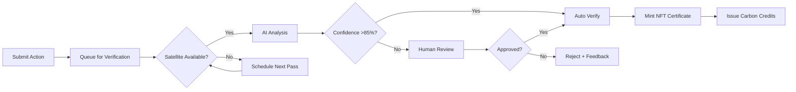

# 🌍 ClimateChain

### Decentralized Climate Verification & Accountability Platform

[](LICENSE)
[](https://polygon.technology/)
[](https://nextjs.org/)

---

## 📋 Overview

ClimateChain is an **AI-powered, blockchain-based platform** that establishes a zero-trust verification system for environmental actions and carbon accounting. By integrating satellite imagery analysis, IoT sensor networks, and cryptographic proof systems, the platform addresses the **$2 billion annual carbon credit fraud problem** while enabling transparent, real-time environmental accountability.

---

## 🚀 Key Features

- **🛰️ Satellite AI Verification** - YOLOv8 & U-Net models analyze satellite imagery to verify environmental claims
- **🔗 Blockchain Certificates** - ERC-721 NFTs for immutable verification certificates on Polygon
- **💰 Carbon Credit Marketplace** - Trade verified ERC-1155 carbon credits
- **🌱 Multi-Action Support** - Reforestation, renewable energy, emissions reduction, sustainable transport
- **🔐 Web3 Authentication** - MetaMask, WalletConnect, and Coinbase Wallet integration
- **📊 Real-time Dashboard** - Track environmental impact with visual analytics

---

## 🏗️ Architecture

```
┌─────────────────────────────────────────────────────────────────┐
│                     CLIMATECHAIN PLATFORM                        │
├─────────────────────────────────────────────────────────────────┤
│  ┌─────────────┐    ┌─────────────┐    ┌─────────────┐         │
│  │  Frontend   │    │   Backend   │    │  Blockchain │         │
│  │  (Next.js)  │◄──►│  (Hardhat)  │◄──►│  (Polygon)  │         │
│  └─────────────┘    └─────────────┘    └─────────────┘         │
│         │                  │                  │                 │
│         ▼                  ▼                  ▼                 │
│  ┌─────────────┐    ┌─────────────┐    ┌─────────────┐         │
│  │  Supabase   │    │ Satellite   │    │    IPFS     │         │
│  │    Auth     │    │   AI/ML     │    │   Storage   │         │
│  └─────────────┘    └─────────────┘    └─────────────┘         │
└─────────────────────────────────────────────────────────────────┘
```

---

## 🛠️ Tech Stack

| Layer | Technology |
|-------|------------|
| **Frontend** | Next.js 14, React 18, TypeScript, Tailwind CSS |
| **Web3** | RainbowKit, Wagmi, Viem |
| **Backend** | Hardhat, Supabase |
| **Blockchain** | Polygon PoS, ERC-721/ERC-1155 Smart Contracts |
| **AI/ML** | ONNX Runtime (YOLOv8 for verification) |
| **Database** | Supabase (PostgreSQL) |
| **Storage** | IPFS for certificate images |
| **Animations** | Framer Motion |

---

## 📁 Project Structure

```
TERRA-AI/
├── frontend/               # Next.js application
│   ├── src/
│   │   ├── app/           # App router pages
│   │   │   ├── dashboard/ # User dashboard
│   │   │   ├── login/     # Authentication
│   │   │   ├── signup/    # User registration
│   │   │   └── verify/    # Verification flow
│   │   ├── components/    # Reusable UI components
│   │   ├── lib/           # Utilities & configurations
│   │   └── types/         # TypeScript type definitions
│   └── package.json
│
├── backend/                # Smart contracts & services
│   ├── contracts/         # Solidity smart contracts
│   ├── supabase/          # Database migrations & configs
│   └── hardhat.config.ts  # Hardhat configuration
│
├── training/              # AI model training resources
│
└── Project Plan/          # Documentation
    ├── ClimateChain_PRD_v1.0.md           # Product Requirements
    └── ClimateChain_Design_Document_v1.0.md # UI/UX Design System
```

---

## 🚦 Getting Started

### Prerequisites

- Node.js 18+
- npm or yarn
- MetaMask wallet (or compatible Web3 wallet)

### Installation

1. **Clone the repository**
   ```bash
   git clone https://github.com/your-repo/TERRA-AI.git
   cd TERRA-AI
   ```

2. **Setup Frontend**
   ```bash
   cd frontend
   npm install
   ```

3. **Setup Backend**
   ```bash
   cd ../backend
   npm install
   ```

4. **Configure Environment Variables**

   Create `.env.local` in the `frontend/` directory:
   ```env
   NEXT_PUBLIC_SUPABASE_URL=your_supabase_url
   NEXT_PUBLIC_SUPABASE_ANON_KEY=your_supabase_anon_key
   NEXT_PUBLIC_GOOGLE_MAPS_API_KEY=your_google_maps_api_key
   ```

   Create `.env` in the `backend/` directory:
   ```env
   POLYGON_RPC_URL=your_polygon_rpc_url
   PRIVATE_KEY=your_wallet_private_key
   ```

5. **Run the Development Server**
   ```bash
   # Frontend (in frontend/ directory)
   npm run dev
   
   # Backend - Compile contracts (in backend/ directory)
   npx hardhat compile
   ```

6. **Open in Browser**
   
   Navigate to [http://localhost:3000](http://localhost:3000)

---

## 📄 Smart Contracts

| Contract | Description |
|----------|-------------|
| **VerificationNFT** | ERC-721 contract for minting verification certificates |
| **CarbonCredits** | ERC-1155 contract for fungible carbon credit tokens |

### Deploy Contracts

```bash
cd backend
npx hardhat run scripts/deploy.js --network polygon
```

---

## 🎨 Design System

ClimateChain uses a custom design system with:

- **Primary Colors**: Earth Green (`#10B981`), Ocean Blue (`#0EA5E9`)
- **Typography**: Inter (primary), JetBrains Mono (code)
- **Dark Mode**: Default for energy efficiency
- **Iconography**: Heroicons + custom eco/blockchain icons

See the full [Design Document](./Project%20Plan/ClimateChain_Design_Document_v1.0.md) for detailed specifications.

---

## 📊 Verification Flow



---

## 🗺️ Roadmap

### Phase 1: Foundation (Current)
- [x] Web3 wallet authentication
- [x] User dashboard
- [x] Action submission flow
- [ ] Satellite image integration
- [ ] Smart contract deployment

### Phase 2: Verification Engine
- [ ] YOLOv8 satellite analysis
- [ ] IoT sensor integration
- [ ] Automated verification pipeline

### Phase 3: Marketplace
- [ ] Carbon credit trading
- [ ] Portfolio management
- [ ] ESG reporting automation

---

## 🤝 Contributing

Contributions are welcome! Please read our contributing guidelines before submitting a PR.

1. Fork the repository
2. Create your feature branch (`git checkout -b feature/AmazingFeature`)
3. Commit your changes (`git commit -m 'Add some AmazingFeature'`)
4. Push to the branch (`git push origin feature/AmazingFeature`)
5. Open a Pull Request

---

## 📝 License

This project is licensed under the MIT License - see the [LICENSE](LICENSE) file for details.

---

## 📞 Contact

**Project Team** - TERRA-AI

**Documentation**: 
- [Product Requirements Document](./Project%20Plan/ClimateChain_PRD_v1.0.md)
- [Design Document](./Project%20Plan/ClimateChain_Design_Document_v1.0.md)

---

<p align="center">
  <strong>🌱 Building a transparent future for climate accountability 🌍</strong>
</p>
